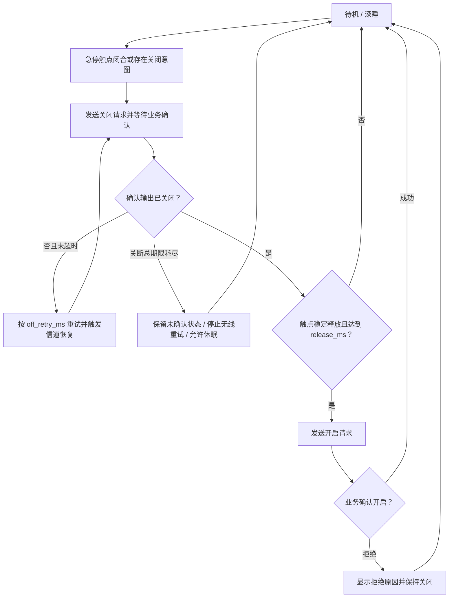
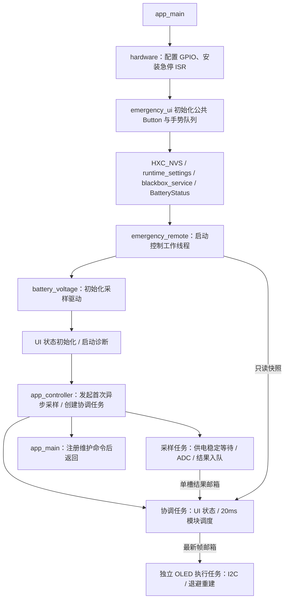
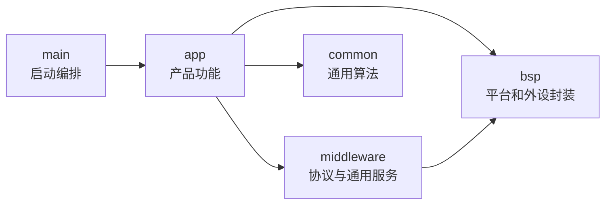

# Wireless Power Emergency Stop

`Wireless_power_emergency_stop` 是一个基于 ESP-IDF 的 ESP32-C3 无线急停开关，

它的核心行为不是“发一个无线包”，而是一笔完整的控制事务：急停触点闭合后优先关闭并
在 `connect_ms` 内重试，超时后停止并允许休眠；触点稳定释放后先取得关闭业务确认才尝试开启，同时维护配对、信道恢复、真实
测量显示、电池管理、深度休眠和黑匣子日志。应用层、无线协议层和链路层相互独立，便于
替换控制目标或修改按键策略。

> 本 README 主要介绍软件架构、运行流程和二次开发入口。具体引脚、电气连接和板级
> 注意事项属于 BSP 与对应组件的实现细节，不在根目录文档中展开。

### 硬件开源链接

[低功耗 ESP-NOW 远程急停按钮（立创开源硬件平台）](https://oshwhub.com/qingmeijiupiao/project_ztiyzlcl)

## 主要功能

- **急停优先关闭**：急停触点下降沿在 ISR 中锁存，控制工作线程独立于 UI 传输，立即
  发起关闭并在固定期限内重试；超时停止无线并允许休眠，不声称已确认关闭。
- **稳定释放后开启**：触点需持续释放达到 `release_ms`，并先收到关闭业务确认，才发送
  开启请求；开启被拒绝不会反复重试。
- **可靠无线控制**：在 ESP-NOW 之上实现链路 ACK、超时重传、重复包过滤和业务响应等待，
  并支持信道恢复。
- **真实测量显示**：接收对端电压、电流和输出状态，超过新鲜窗口显示离线；界面同时呈现
  保护与拒绝原因。
- **电池状态管理**：异步采样电池电压，估算显示电量；插电后按满电 4.2 V 自动校准分压倍率。
- **深度休眠**：静置到期且在安全条件下进入深睡，最后一分钟显示倒计时；按键、急停触点和
  插电均可唤醒。
- **运行诊断**：记录复位/唤醒、电量、无线事务、保护与设置变更，并通过黑匣子持久化。
- **维护控制台**：提供电池、遥控、配置、GPIO、故障历史和黑匣子命令。

运行时日志、Shell 输出和黑匣子字符串统一使用 ASCII 英文，避免串口工具、日志解析脚本或
不同终端编码配置产生乱码。源码注释和开发文档使用中文。

## 默认运行流程

急停控制事务等待“关闭已确认”或本轮 `connect_ms` 总期限耗尽：



这里的“可靠发送”包含两层确认：

1. **链路 ACK**：说明数据已经到达对端 ESP-NOW 链路。
2. **业务响应**：说明对端应用已经解析并处理了控制请求。

链路 ACK 成功不等于输出一定切换成功。例如功率计处于保护或短路状态时，可以收到请求，
但业务层仍会拒绝开启。

### 源码启动流程

`main/app_main.cpp` 编排有依赖的初始化，随后启动 `app_controller` 协调任务并注册 Shell，主任务返回。
急停控制、Button 事件和电池采样各自运行；OLED 初始化与首次采样可以同时进行，
主任务不再先等待 100 ms 或等待首次电池读数。



100 ms 供电稳定窗口从 GPIO 初始化完成时计算，采样任务只等待剩余时间；NVS 和无线初始化
占用的时间会计入窗口。首次电压未就绪时界面使用未知值或 RTC 保留电量，取得结果后自动更新。
启动诊断不等待电池，首次成功采样另记 `boot battery ready` 产品事件。

UI 状态由协调任务管理，OLED 驱动由显示任务独占；休眠关闭通过带确认的代际命令握手。
Shell 通过原子故障历史和带互斥的
BatteryStatus 接口读取状态。采样回调只发布结果，不直接操作 UI 或电量服务。

## 软件架构

工程采用 ESP-IDF Component 组织代码。每个 Component 是一个拥有独立公开接口、源码、
依赖声明和说明文档的模块。

```text
main/
  app_main.cpp                初始化与任务启动入口
components/
  app/                        与本产品行为直接相关的应用组件
    app_controller/           产品协调任务与模型构建
      src/battery_monitor.cpp 采样、USB、校准启动与电量上报策略
      src/input_actions.cpp   菜单动作落地与配对入口检查
      src/sleep_coordinator.cpp 手动/自动休眠协调
      src/event_recorder.cpp  状态变化日志与独立去重基准
    battery_voltage/          电池电压采样与校准
    boot_diagnostics/         固件、复位/唤醒、配置和电池启动快照
    emergency_remote/         急停事务、关闭重试、信道恢复和数据快照
    emergency_ui/             显示驱动、按键适配、页面框架与菜单
      core/                   Page 抽象、UI 状态、按键适配与 UiManager
      pages/                  状态屏、菜单屏、消息屏
    power_manager/            静置计时、倒计时、休眠安全检查及进入/恢复
    runtime_settings/         参数及常亮模式的 HXC_NVS 持久化
    shell_command/            维护命令注册
  bsp/
    hardware/                 GPIO、电气状态、板级隔离与 USB PHY
    sh1106/                   SH1106 I2C 显示驱动
scripts/                      本地构建入口与固件合并脚本
```

配对、无线协议、可靠链路、日志捕获、电量估算、NVS/Flash 缓冲、插值、ADC、公共按键、
`wifi_manager`、`shell` 和 `diagnostic_log` 等共用组件已迁移到
[wireless-power-components](https://github.com/qingmeijiupiao/wireless-power-components)
公共仓库，由 `main/idf_component.yml` 固定引用，实际源码不在本仓库。

总体依赖方向是：



这条规则的目的不是追求目录形式，而是限制依赖范围：

- `main` 展示组件初始化顺序与任务启动，不实现运行期业务。
- `app_controller` 编排运行期调用顺序；各功能模块分别持有自己的时序与状态。
- `app` 决定急停、菜单、休眠和命令的含义，以及如何反馈结果。
- `middleware` 负责可靠传输、配对、日志和按键等可复用机制，不决定产品语义。
- `bsp` 封装 ESP-IDF 外设和平台接口，不依赖产品业务。

## 关键组件如何协作

### 急停触点与无线事务

`emergency_remote` 是一个独立的工作任务：

- 触点下降沿在 ISR 中锁存，工作任务每 10 ms 检查输入；锁存后强制关闭并作废待发开启。
- 触点需持续释放达到 `release_ms`，并先收到关闭业务确认，才排队开启。
- 关闭未确认会按 `off_retry_ms` 重试，并触发加密信道恢复；通信恢复后无需再次按键。
- 联机后以 5 Hz 请求数据，数据超过 `fresh_ms` 视为离线。
- 联机时周期通过原有协议回传电池百分比，兼容 Lite 与 Pro V2。

### 界面与按键

`app_controller` 的协调循环只串联电池、输入动作、休眠、事件记录和界面刷新。
业务分支与时序状态分别位于私有功能模块；拆分职责不会为每个小功能再创建轮询任务。
模块边界及通信方式见 [app_controller](components/app/app_controller/README.md)。

`emergency_ui` 采用页面框架：`core/` 定义 `Page` 抽象与 `UiManager`，`pages/` 实现状态屏、
菜单屏和消息屏。`UiManager` 统一负责选页、按键分发、故障确认、低电提示和刷新节奏。

- `StatusPage`：状态、主页、连接失败和休眠倒计时合成画面。
- `MenuPage`：菜单列表、条目确认、设备信息和休眠时长四个视图。
- `MessagePage`：一次性消息页。

`emergency_ui` 内部的按键适配基于公共 `Button` 组件，在 GPIO3 上识别短按与长按并投递到手势
队列，由协调任务消费；唤醒时若按键仍被按住，会抑制到释放为止。按键阈值采用公共组件固定值
（消抖 5 ms、长按 1000 ms、超长按 3000 ms、双击窗口 250 ms），本工程只使用短按与长按。

### 深度休眠

`power_manager` 统一判断休眠条件并配置休眠入口。只有在以下条件满足后才会进入深度休眠：

- 急停输出已确认关闭或可安全确认；
- 急停触点状态稳定；
- 没有待处理控制事务；
- 按键已释放；
- 提示与倒计时已结束。

深度休眠会让程序从 `app_main()` 重新启动。跨休眠保留的数据分别存放在 RTC 保持内存
（短期显示电量、故障历史）和 NVS（配对、校准、运行参数）。没有定时唤醒，GPIO3 按键、
GPIO5 触点变化和 GPIO4 插电均可唤醒。

### 黑匣子日志

普通串口日志在断电或深度休眠后会消失。关键状态变化通过公共 `diagnostic_log` 的
`DEVICE_EVENT_I("ProductEvent", ...)` 标记输出，由 `blackbox_service` 的日志 hook 按白名单
持久化；`ESP_LOGW` / `ESP_LOGE` 也会被 hook 自动写入。循环分区写满后覆盖最旧记录。

### 参数与 Shell

`runtime_settings` 把全部运行参数保存在公共 `HXC_NVS` 中，运行期读取使用原子缓存，避免
工作线程与 Shell 任务竞争。产品命令集中注册在 `components/app/shell_command/`，只做参数
解析和线程安全请求，不持有无线状态。

## 硬件

| 功能 | GPIO / 端口 |
|---|---|
| SH1106 SDA / SCL | GPIO1 / GPIO2 |
| OLED 供电使能 | GPIO6，高电平开启低侧 Q1 |
| 急停触点 | GPIO5，闭合接地（低电平关闭），高电平释放 |
| USB 供电检测 | GPIO4 |
| 电池 ADC / 分压下端 | GPIO0 / GPIO10，采样期间将 GPIO10 拉低 |
| BOOT 菜单 / 唤醒 | GPIO3，同时连接 GPIO9 |

OLED 使用 I2C 400 kHz，自动探测 0x3C/0x3D，列偏移 2，SDA/SCL 可在 menuconfig 中调整。
电池分压路径只在采样窗口内导通，其余时间保持高阻以降低静态功耗。

## 配对与无线联调

在 Pro V2 Shell 执行 `espnow pair 120`，随后在急停板 Shell 执行 `remote pair`。两端配对
成功后退出配对模式，急停板先确认关闭，再以 5 Hz 请求电压、电流和输出状态。

| 急停板命令 | 行为 |
|---|---|
| `remote pair` | 主动配对，不清除已有记录 |
| `remote status` | 打印远端状态、电压、电流和保护掩码 |
| `remote stop` | 请求关闭并保持重试，不产生自动开启 |
| `remote on` | 诊断开启请求；物理触点闭合时忽略 |
| `remote retry` | 重新开始连接尝试 |
| `battery status` | 电池电压、电量和校准快照 |
| `remote test-channel` | 临时切到错误信道 6，用于恢复测试 |

USB 串口 115200，先按回车进入公共 Shell 的 `ESTOP>` 提示符，输入 `exit` 返回日志模式。
物理急停控制在诊断期间仍然有效，闭合与关闭处理会覆盖诊断页面。

## 参数 Shell

`config` 列出全部参数及有效范围，`set <name> <value>` 保存成功会打印 `SAVED` 并写入 NVS；
超出范围、非法参数或保存失败不会更新运行值。常用命令：

```text
version
config
set connect_ms 5000
set idle_ms 300000
set menu_idle_ms 15000
set notice_ms 30000
set release_ms 100
set battery_ms 30000
set report_ms 30000
set low_mv 3500
battery status
battery reset-calibration
remote status
remote stop
remote on
remote retry
remote pair
remote repair
remote test-channel
gpio
fault
blackbox status
blackbox dump 50
blackbox clear
blackbox mark <text>
```

`connect_ms` 为连接窗口；`idle_ms` 为统一静置休眠时间（300000..3600000）；其余 `_ms` 参数
单位为毫秒。菜单“休眠时间”提供 5m、10m、30m、1h，保存到 NVS。“静置”依据 BOOT 输入、急停
控制状态变化和用户串口操作，周期采样与数据刷新不重置静置计时。

## 构建

### 环境要求

- ESP-IDF v6.0+
- Python 3
- 目标芯片：ESP32-C3

```powershell
idf.py set-target esp32c3
idf.py build
```

本机封装入口（仅对子进程关闭 Git CRLF 转换，以保持公共组件哈希与 Git blob 一致）：

```powershell
python scripts/idf_local.py build
python scripts/validate_firmware.py
python scripts/verify_display.py --port <PORT>
```

构建完成后生成：

- `build/Wireless_power_emergency_stop.bin`：仅应用程序；
- `Wireless_power_emergency_stop_merged.bin`：Bootloader、分区表和应用程序合并固件。

## 烧录方式

仅更新应用程序（Bootloader 与分区表未变化时），不覆盖 NVS，配对与校准保留：

```powershell
idf.py -p <PORT> flash
```

完整烧录适用于首次安装、故障恢复或分区布局变化：

```powershell
esptool.py --chip esp32c3 write_flash 0x0 Wireless_power_emergency_stop_merged.bin
```

不要把 APP 固件写入 `0x0`，也不要把 merged 固件写入 `0x10000`。曾观察到 USB 复位停在
下载模式，拔插 USB 后恢复。

## 在线烧录与固件下载

ESP Launchpad 需要使用支持 Web Serial 的 Chromium 系浏览器。

| 入口 | 说明 |
|------|------|
| [APP 固件在线烧录](https://espressif.github.io/esp-launchpad/?flashConfigURL=https://cdn.jsdelivr.net/gh/qingmeijiupiao/Wireless_power_emergency_stop@firmware-dist/launchpad/latest.toml&app=Wireless_power_emergency_stop_app&exact=true) | 保留 NVS，适合常规升级 |
| [merged 固件在线烧录](https://espressif.github.io/esp-launchpad/?flashConfigURL=https://cdn.jsdelivr.net/gh/qingmeijiupiao/Wireless_power_emergency_stop@firmware-dist/launchpad/latest.toml&app=Wireless_power_emergency_stop_merged&exact=true) | 完整安装或恢复，会清除 NVS |

固定的最新固件地址：

- [最新 APP 固件](https://cdn.jsdelivr.net/gh/qingmeijiupiao/Wireless_power_emergency_stop@firmware-dist/latest/app.bin)
- [最新 merged 固件](https://cdn.jsdelivr.net/gh/qingmeijiupiao/Wireless_power_emergency_stop@firmware-dist/latest/merged.bin)
- [最新版本元数据](https://cdn.jsdelivr.net/gh/qingmeijiupiao/Wireless_power_emergency_stop@firmware-dist/last.toml)

不要把 APP 固件写入 `0x0`，也不要把 merged 固件写入 `0x10000`。

## 版本与发布

版本格式为 `MAJOR.MINOR.PATCH`：

- 开发者维护顶层 `CMakeLists.txt` 中的 `MAJOR` 和 `MINOR`；
- 本地构建使用 `PATCH=99`，表示非正式固件；
- 标签发布由 CI 使用 `PATCH=0` 构建，例如 `v0.2.0`；
- 编译时间统一按 UTC+8 写入固件。

推送 `main`、提交 PR 或手动运行会触发 CI，编译固件、验证合并固件布局并上传 Actions
artifacts。推送 `vMAJOR.MINOR` 或 `vMAJOR.MINOR.0` 标签触发发布构建，生成 APP、merged、
SHA256SUMS 和 Launchpad 配置，发布到本仓库的 GitHub Release 并更新 `firmware-dist` 分支。

## 组件文档

| 模块 | 文档 |
|------|------|
| 产品协调器 | [app_controller](components/app/app_controller/README.md) |
| 电池采样 | [battery_voltage](components/app/battery_voltage/README.md) |
| 电源管理 | [power_manager](components/app/power_manager/README.md) |
| Shell 命令 | [shell_command](components/app/shell_command/README.md) |
| 公共按键 | [Button](https://github.com/qingmeijiupiao/wireless-power-components/blob/b9816655d7e1db46a8e5d3c7e29e05d9edb5f9a4/components/middleware/Button/README.md) |
| 产品业务协议 | [espnow_service_remote](https://github.com/qingmeijiupiao/wireless-power-components/blob/b9816655d7e1db46a8e5d3c7e29e05d9edb5f9a4/components/product/espnow_service_remote/README.md) |
| 协议编解码 | [espnow_service_proto](https://github.com/qingmeijiupiao/wireless-power-components/blob/b9816655d7e1db46a8e5d3c7e29e05d9edb5f9a4/components/product/espnow_service_proto/README.md) |
| ESP-NOW 链路 | [espnow_link](https://github.com/qingmeijiupiao/wireless-power-components/blob/b9816655d7e1db46a8e5d3c7e29e05d9edb5f9a4/components/middleware/espnow_link/README.md) |
| 电量估算 | [battery_level](https://github.com/qingmeijiupiao/wireless-power-components/blob/b9816655d7e1db46a8e5d3c7e29e05d9edb5f9a4/components/middleware/battery_level/README.md) |
| 黑匣子服务 | [blackbox_service](https://github.com/qingmeijiupiao/wireless-power-components/blob/b9816655d7e1db46a8e5d3c7e29e05d9edb5f9a4/components/middleware/blackbox_service/README.md) |
| 黑匣子存储 | [blackbox](https://github.com/qingmeijiupiao/wireless-power-components/blob/b9816655d7e1db46a8e5d3c7e29e05d9edb5f9a4/components/middleware/blackbox/README.md) |

## 共用组件

`battery_level`、`blackbox_service`、`espnow_service_remote`、`espnow_link`、`Button` 等遥控与
交互组件，以及 `HXC_NVS`、`ADC`、`wifi_manager`、`shell`、`circular_flash_buffer`、`Interp`、
`blackbox`、`diagnostic_log` 等通用组件统一固定到 `b9816655d7e1db46a8e5d3c7e29e05d9edb5f9a4`，
由 Component Manager 自动下载，不依赖本地相邻目录。`main/idf_component.yml` 使用 YAML 锚点
集中定义仓库地址与版本，升级时只需修改锚点处一处。
